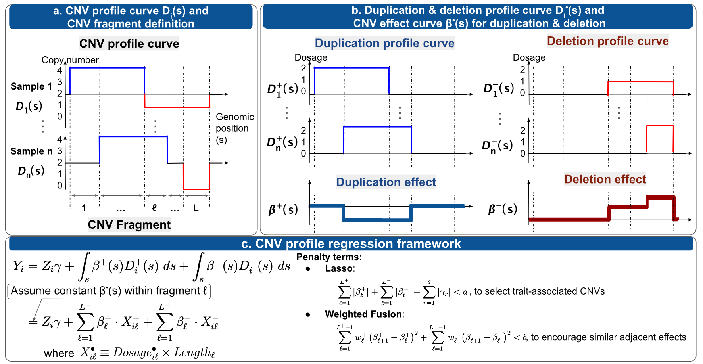

  
```{r setup, include=FALSE}
knitr::opts_chunk$set(
  collapse = TRUE,
  comment = "#>"
)
knitr::opts_knit$set(root.dir = "~/CNVreg_121")

```


## Introduction

The *CNVreg* package provides functions to perform association analysis between a binary (or continuous) outcome and the copy number variants (CNVs) over a genomic region. CNVs are DNA gains or losses that can range in length from 50 base pairs (bp) to megabase. The CNV association analysis needs to consider the effects of both the dosages and the length of CNVs.  To incorporates the information of CNV length and dosage, this package use a "CNV profile curve" to convert CNVs over a genomic region as a piecewise constant curve, which naturally dipicts the detailes of CNVs. The association analysis is then evaluated by regressing outcome values on the entire CNV profile curve while adjusting for covariates. The corresponding CNV effects are obtained at each genome position (i.e., effect of per bp or effect of per hundred bp of CNV), which is directly comparable across different studies.

## Functions in *CNVreg* package

The *CNVreg* package has three main functions: `prep()` for data preparation, `cvfit_WTSMTH()` for cross-validation to select the best pair of many candidate tuning parameters and generate the effect coefficient at the selected tuning parameters, and `fit_WTSMTH()` for directly fitting a model with one pair of specific tuning parameters.  

Here, we load a simulated dataset in the package to illustrate how to use *CNVreg* package to do CNV association analysis.
```{r}
 
 library(CNVreg)
 data("CNVCOVY")
```

There are four seperate data files in the dataset:

  A. The `CNV` file is a PLINK format data frame that contains CNV events within a genome region. In this data file, we simulated CNV events for 800 individuals out of 1000 samples on Chromosome 1.
     
```{r}
 head(CNV)
 summary(CNV)
```

  B. The `Cov` file is a data frame that contains covariant information. Here, we randomly simulated "SEX" and "AGE" as covariants for all 1000 samples. 
  
       
```{r}
head(Cov)
 summary(Cov)
```
  
  C. Outcome trait
  
  C.1 The `Y_QT` is a continuous trait.
         
```{r}
head(Y_QT)
summary(Y_QT)
```   
C.2 The `Y_BT` is a binary trait.
         
```{r}
head(Y_BT)
table(Y_BT$Y)
``` 


#### The data preparation function: prep()

To get started, we apply the data preparation function `prep()` to format the data. Here we use the continous outcome `Y_QT` for illustration. It's the same procedure if the user starts with a binary outcome. 

The `prep()` function has 2 main purposes. 
  
     First, it converts an individual's CNV events within a genomic region to a CNV profile curve, further processes it as CNV fragments, and filter out rare fragments. 
     
     Second, it analyzes the adjacency relationship between CNV fragments and prepares different options of weight matrices for the penalized regression analysis. 
     
```{r, echo=TRUE, warning=FALSE, message=FALSE, include=FALSE}
 
 frag_data <- prep(CNV = CNV, Y = Y_QT, Z = Cov, rare.out = 0.05)
 
```

The `prep()` function has 4 inputs: `CNV`, `Y`, `Z`, and `rare.out`. 
  
     `CNV` is a PLINK format text file that containes CNV events within a genome region. The CNVs are required to be processed one chromosome at a time.
     
     `Y` takes the outcomes of interest, which could be a binary or continuous trait.
     
     `Z` takes the covariates for adjustment, it's also OK to have no covariates.
     
     `rare.out` is to filter out rare CNV fragments below the thresholdto, it has a default value 0.05.
     

```{r}
 
 str(frag_data)
 
```

  The output of `prep()` function provides all information needed to perform further regression analysis. It has a list of six objects:
  
    `design`: the CNV fragments in n by p dimensions, where n is the number of samples and p is the total number of CNV fragments. 
    
    `Z`: a matrix of covariates with sample ID as rownames. The rownames are in the same order as in the outcomes. 
    
    `Y`: a matrix of 1 column with sample ID as rownames. The rownames are in the same order as in the covariates.
    
    `weight.structure`: a matrix that describes the adjacency structure of CNV fragments. The matrix is sparse and most values are zero, while adjacent non-zero values represent two adjacent CNV fragments that are overlapped by at least one CNV event in the population. 
    
    `weight.options`: we provide 6 different options of weights that encourage differential information sharing based on the relationship between adjacent CNV fragments. 
    
             Equal weight `eql` means all adjacent CNV fragments are weighted by 1.
             
             Coscine-similarity based weight `wcs` would encourage more similar CNV fragments to share more information by increasing the relative weights. 
             
             Inverse frequency weight `wif` would encourage rare events to borrow information from nearby more frequent CNV fragments. 
             
             All three versions of weights can further improve their relative weights by multiplying the sample size that have CNV events overlapping a continuous region of CNV fragments ("keql", "kwcs", and "kwif").
             
    `CNVR.info` summarizes the positions of all CNV fragments and their adjacency information. Each row represents a CNV fragment and the fragment names match the column names in `design`


#### 2. The association analysis with cross-validation (CV) to fine-tune parameters for a penalized regression model: `cvfit_WTSMTH()`

  The `cvfit_WTSMTH()` function analyzes the association between a continuous/binary trait value and `CNV` while adjusting for the covariates `Cov`. 
  Since we already have `Y_QT` prepared in the `prep()` step, we will fit a model to perform the association analysis for a continuous outcome first. 
  
 
```{r}
  b_c_tune <- cvfit_WTSMTH(data = frag_data, lambda1=seq(-8, -5, 0.5), lambda2 = seq(-4,0,1), weight="eql", family = "gaussian")
```


```{r}
str(b_c_tune)
```
 
 
```{r}
b_c_tune$Loss |> print()
```

```{r}
b_c_tune$selected.lambda |> print()
```
For the first round of parameter tuning, the selected lambda_1 (-5) is at the right edge of the candidate range (-8:-5).  The selected lambda_2 (-2) is within the candidate range (-4:0). For a second round of parameter tuning, we adjust the candidate lambda_1 = (-5, -4.5, -4, -3.5, -3), and lambda_2 = (-4:0)
```{r}
b_c_tune$coef[which(abs(b_c_tune$coef$coef)>0),]
```
 
  ###### 2.1 The penalty terms and the tuning parameters in the association analysis. 
  
   The `cvfit_WTSMTH()` uses a generalized linear model with 2 penalty terms to perform the assiciation analysis. The strength of the penalization is controled by a tuning parameter for each penalty terms.   

   Penalization for sparsity:
       
      An L\textsubscript{1} Lasso penalty to select trait-associated CNV fragments. 

      The tuning parameter $\lambda_{1}$ controls the level of penalization for sparsity. As $\lambda_{1}$ increases, the model increases in sparsity, leading to fewer variables with non-zero coefficients

   Penalization for smoothness: 
            
      A weighted $L_{2}$-fusion penalty on the adjacent CNV fragments to encourage similar effect coefficients between two consecutive fragments. 

      The tuning parameter $\lambda_{2}$ controls the level of penalization for smoothness. As $\lambda_{2}$ increases, the coefficients for adjacent CNV fragments become more similar to each other. 
      When  approaches 0, the model reduces to a Lasso regression.
       
   The penalized regresssion model allows the CNV profile regression to estimate association effects, select trait-associated fragments, and smooth effect sizes for adjacent CNV fragments simultaneously.
   
   ###### 2.2 The n-fold cross-validation to fine-tune parameters $\lambda_{1}$ and $\lambda_{2}$

   We use an n-fold CV and grid search strategy to select the optimal tuning parameter values from candidate $\lambda_{1}$ and $\lambda_{2}$ values. The best pair of tuning parameters that minimizes the average validation loss in the n-fold CV is used to determine the final estimate of coefficients. 

   ###### 2.3  Inputs and outputs of `cvfit_WTSMTH()`
   
  The `cvfit_WTSMTH()` function has 7 inputs.
      
     `data` is a list object produced from the `prep()` function
        
     `lambda1` and `lambda2` are the two vectors of candidate tuning tuning parameters for the Lasso penalty and the weighted fusion penalty. The n-fold CV would select the optimal parameters from these candidates. During the implementation, we transforms the two values as $2^{8}$ where * represents each element of the two vectors.
        
    `family` must choose from "gaussian"/"binomial", which indicates a continuous/binary outcome.

    `cv.control` has its default values. It controls the cross validation procedure with a few variables: 
             The number of folds (`nfolds`) used in cross-validation. A default value is 5. It can be chosen to have other number of folds (such as 3, 10) depending on the sample size, time and resource limitation.
             
             The number of cores (`ncores`) for parallel computing. check available computation resource before choosing.
             
             And, if the random data splits should be stratified (`stratified`) to make the number of cases and the controls to be compatible in each fold, which is necessary for a binary outcome with a rare category. if `stratified` = TRUE and `family` = "binomial", the folds will be stratified within each category of Y. This option is recommended if the sample size of different categories of the outcome is unbalanced.)

    `iter.control is specificly used for a binary outcome.  It also has its default values for the components and controls the stop criteria for the iteratively reweighted least square procedure.
    
         `max.iter` is the maximun number of iterations to perform, it guarantees the package to get a result within a reasonable time. The default value is set as 8. Previous tests shows after 3 to 4 iterations the results are quite similar to each other. 
  
         `tol.beta` is the threshold below which the procedure is deemed converged, which controls the absolute difference between consecutive beta updates (default = $10^{(-3)}$). 
         
         `tol.loss` is the threshold  below which the procedure is deemed converged, which controls the difference in consecutive loss updates (default = $10^{(-6)}$). 
 
 
 The output of the `cvfit_WTSMTH()` function is a list object contains 3 elements: `loss`,  `lambda.selected`, and `coef`.

    The `loss` is a table of the average validation loss for all combinations of candidate tuning parameters. The rownames are the candidate $\lambda_{1}$ values, the colnames are the candidate $\lambda_{2}$ values, and loss is each entry in the corresponding fields. 

    The `lambda.selected` are the optimal tuning parameters with the lowest loss, which can be double-checked with the `loss` table.
    
    The estimated beta coefficients `coef` at the selected tuning parameters. It has `(intercept)`, CNV fragments (with detailed positions/type information), and covariate effects.

#### 3. The association analysis with a specific pair of parameters $\lambda_{1}$ and $\lambda_{2}$ for a penalized regression model: `fit_WTSMTH()`

  ###### 2.1 The penalty terms and the tuning parameters in the association analysis. 
  
   The `fit_WTSMTH()` and the `cvfit_WTSMTH()` uses the same analytical methods with a generalized linear model with 2 penalty terms to perform the assiciation analysis. The penalized regresssion model allows the CNV profile regression to estimate association effects, select trait-associated fragments, and smooth effect sizes for adjacent CNV fragments simultaneously.
   
   The strength of the penalization is controled by a tuning parameter for each penalty terms. The tuning parameter $\lambda_{1}$ controls the $L_{1}$ Lasso penalty to perform variable selection; the tuning parameter $\lambda_{2}$ controls the weighted $L_{2}$-fusion penalty to perform effect smoothness. Unlike the `cvfit_WTSMTH()` function that will fine-tune the parameters and select the optimal combination of $\lambda_{1}$ and $\lambda_{2}$, the `fit_WTSMTH()` function takes one value for $\lambda_{1}$ and one value $\lambda_{2}$ and estimate the coefficients for the given pair of parameters. This function is used when the user knows the optimal tuning parameters, or when the user wants to do preliminary tests before the formal analysis. It is much faster to perform `fit_WTSMTH()` than the `cvfit_WTSMTH()`. 
       
   ###### 2.2  Inputs and outputs of `fit_WTSMTH()`
   
  The `fit_WTSMTH()` function has 6 inputs. Compare to the `cvfit_WTSMTH()`, `fit_WTSMTH()` does not need the input term that controls CV procedure. 
      
     `data` is a list object produced from the `prep()` function
        
     `lambda1` and `lambda2` are the two vectors of candidate tuning tuning parameters for the Lasso penalty and the weighted fusion penalty. The n-fold CV would select the optimal parameters from these candidates. During the implementation, we transforms the two values as $2^{8}$ where * represents each element of the two vectors.
        
    `family` must choose from "gaussian"/"binomial", which indicates a continuous/binary outcome.

    `iter.control is specificly used for a binary outcome.  It also has its default values for the components and controls the stop criteria for the iteratively reweighted least square procedure.
    
         `max.iter` is the maximun number of iterations to perform, it guarantees the package to get a result within a reasonable time. The default value is set as 8. Previous tests shows after 3 to 4 iterations the results are quite similar to each other. 
  
         `tol.beta` is the threshold below which the procedure is deemed converged, which controls the absolute difference between consecutive beta updates (default = $10^{(-3)}$). 
         
         `tol.loss` is the threshold  below which the procedure is deemed converged, which controls the difference in consecutive loss updates (default = $10^{(-6)}$). 
 
 
 The output of the `fit_WTSMTH()` function is the estimated `coef` at the given \lambda_{1}$ and $\lambda_{2}$ values. It has `(intercept)`, CNV fragments (with detailed positions/type information), and covariate effects.


## A quick example to implement the *CNVreg* package

```{r load CNVreg package}
# need to compile before being officially published
# currently is not compiled
#library("CNVreg")

```

### Load the simulated data as a quick example
We simulated this set of data to demonstrate how the CNVreg package works. The input data file *CNV* is in PLINK format with required columns (and the proper column names): sample ID ("ID"), Chromosome ("CHR"), CNV starting position ("BP1"), CNV ending position ("BP2"), and CNV type ("TYPE"). The covariate file *Covatiate* includes confounders to be adjusted with a required sample ID ("ID") column and a desired number of covarites in the following columns. Here we simulated "sex" as a covariate variable. The outcome can be either a continuous outcome or a binary outcome, which has a column of sample ID ("ID") and a column of outcome trait of interest. 
For illustration purpose, we prepared two outcome files to showcase the continuous outcome (Y_ctns) and the binary outcome (Y_bnry). 
We set the intercept to -2, covariate sex has effect 0.2 for sex=1, and the non-zero signals are set at CNV fragments (del64:del74) with b[del64:del74] = 1 for continuous outcome and b[del64:del74] = 2 for binary outcome. 
```{r load the quick example using simulated data}
# need to double check how to load data from the package's datafile
# Example is based on rare data, need to modify the dataset
#data("CNVreg")
#CNV=data("CNV")
#Cov=data("Covariate")
#Y_ctns=data("Y_ctns")
#Y_bnry=data("Y_bnry")
```

### Preprocessing CNV data and prepare for regression with function prep(). 

```{r echo=TRUE}
#for continuous outcome
#cnvcov_c <- prep(CNV = cnvData, Y = Y_ctns, Z = covData, rare.out = 0.0001)
#for binary outcome, similar code
#cnvcov_b <- prep(CNV = cnvData, Y = Y_bnry, Z = covData, rare.out = 0.0001)
```

### Fit a penalized regression with lasso and weighted fussion using fit_WTSMTH() at a given level of tuning parameters
```{r echo=TRUE}
#for continuous outcome
#b_c <- fit_WTSMTH(data=cnvcov_c, lambda1 = -8, lambda2 = 0, weight="eql", family = "gaussian")
# for binary outcome
#b_b <- fit_WTSMTH(data=cnvcov_b, lambda1 = -8, lambda2 = 0, weight="eql", family = "binomial")

```
In fit_WTSMTH() function, 
*data* is the output from prep() function.
*lambda1* and *lambda2* are provided by the user to control the sparsity of variable selection and the level of effect smoothness. A larger *lambda1* would produce a sparser result with fewer CNV fragments selected to be important. A larger *lambda2* would encourage adjacent CNV fragments to have more similar effect sizes. In the function fit_WTSMTH(), *lambda1* and *lambda2* are both converted to 2^(lambda1) and 2^(lambda2), so the user can choose from real number. 
*weight* can be chosen from the weight.options from the prep() function, available options are ("eql", "wcs", "wif", "keql", "kwcs", "kwif").
*family* can be "gaussian" for a countinuous outcome and "binomial" for a binary outcome. 
The output of fit_WTSMTH() function is the coefficients of all variables, including intercept, CNV effects, covarite effects. 


### Cross validation to fine-tune parameters ( $\lambda_1$ and $\lambda_1$) using cvfit_WTSMTH()
```{r echo=TRUE}
#for continuous outcome
#b_c_cv <- cvfit_WTSMTH(data=cnvcov_c, lambda1 = seq(-15,-5, 3), lambda2 =seq(-4, 4, 2), weight="eql", family = "gaussian")
# for binary outcome
#b_b_cv <- cvfit_WTSMTH(data=cnvcov_b, lambda1 = seq(-15,-5, 3), lambda2 = seq(-4, 4, 2), weight="eql", family = "binomial")

```
The cvfit_WTSMTH() function accepts similar terms as in function fit_WTSMTH(). The main difference is that *lambda1* and *lambda2* are accepting a series of candidate values and the cross validation procedure would pick the best pair of parameters  $\lambda_1$ and $\lambda_1$ that minimize the validation loss.  
By default, the function would perform 5-fold cross validation and the user can specify a different number of folds by specify the *nfold*. 
To allow faster processing, the user can also specify using parallele computing by asign the number of cores for the computation by specify *ncore*.
The output of fit_WTSMTH() function gives the best pair of  $\lambda_1$ and $\lambda_1$ from the candidate values and the corresponding coefficients of all variables, including intercept, CNV effects, covarite effects. Usually the user has to start from a broader range of candidate values and narrow it down by updating the candidates after observing the results. 

### Compare the true signal with the estimates
```{r echo=TRUE}
######################non-zero signals for simulation
#intercept b0: -2
#b["age"]: 0.2
#b_c_true[paste0("del", 64:74)] : 1,
#b_b_true[paste0("del", 64:74)] : 2 
#######################################
#print(b_c[c(paste0("del", 64:74),"SEX")])
#print(b_b[c(paste0("del", 64:74),"SEX")])
#b_c[c(paste0("del", 64:74),"SEX")]
#    del64     del65     del66     del67     del68     del69     del70     del71     del72     del73     del74  SEX
#1.0697263 0.7340689 0.6140854 0.7105877 0.9127402 1.1526129 0.9647277 0.6429805 0.3862995 0.2116475 0.1246587 0.1926006

#b_b[c(paste0("del", 64:74),"SEX")]
#     del64      del65      del66      del67      del68      del69      del70      del71      del72      del73      del74        SEX 
#0.33640068 0.06808373 0.00000000 0.00000000 0.00000000 0.09740618 0.00000000 0.00000000 0.00000000 0.00000000 0.00000000 0.15653618 
########CV tuning 
#for ctns: tuning parameters selected: lambda1 =-9, lambda2=-2
#print(b_c_cv$coef[c(paste0("del", 64:74),"SEX")])
#
#    del64     del65     del66     del67     del68     del69     del70     del71     del72     del73     del74  SEX
#1.2101534 0.6822391 0.4956110 0.6679145 0.9172944 1.2647549 1.0794324 0.5713049 0.1205602 0.0000000 0.0000000 0.207478

#for binary: tuning parameters selected: lambda1 =-12, lambda2=-4
#print(b_b_cv$coef[c(paste0("del", 64:74),"SEX")])
#     del64      del65      del66      del67      del68      del69      del70      del71      del72      del73      del74  SEX
#0.18972697 0.00000000 0.00000000 0.00000000 0.07393405 0.25124648 0.01072678 0.00000000 0.00000000 0.00000000 0.00000000 0.2061167

### False positives


### use plots to compare true signal and estimated signals


## A brief summary of the CNVreg penalized regression framework

### The CNVreg framework 


Figure 1.a. The CNV profile curve, denoted as $D_i(s)$, represents the CNV events of individual $i$ across a genomic region. CNV "fragments", one commonly used CNV locus definition, can be defined based on the breakpoints observed. 


Figure 1.b. The CNV profile curve can be decomposed into a duplication profile curve $\left(D^+_i(s)\equiv\max\left( [D_i(s)-2],0\right)\right)$ and a deletion profile curve $\left(D^-_i(s)\equiv\max\left(-[D_i(s)-2],0\right)\right)$. The effects of duplication/deletion on the traits are captured by the duplication/deletion effect curves. 


Figure 1.c. CNV profile regression evaluates the association between CNVs and trait value $Y$ by regressing $Y$ on the duplication and deletion profile curves, without the need to pre-define CNV loci. If assuming constant effects within a CNV fragment, the model can be reduced to model CNV effects at the fragment level, where the CNV predictor $\left(X\right)$ is the product of CNV dosage and fragment length. The regression uses an L$_1$ Lasso penalty to select trait-associated CNVs and uses a weighted L$_2$ fusion penalty to encourage similar adjacent effects.


The *CNVreg* framework is desiged to perform association analysis between an outcome trait and an individual’s entire copy number variant profile within a genomic region. The method represents an individual's CNV events using a piecewise constant curve called "CNV profile" curve (Figure 1.a) over a genomic region (e.g., chromosome). The association is then evaluated by regressing trait values on the entire CNV profile curve while adjusting for covariates.
The corresponding CNV effects are obtained at each genome position and  described using the "CNV effect" curves (Figure 1.b), which can be directly compared across different studies.

To control model complexity and leverage CNV fragment structural information in model estimation, CNVreg applies an $L_1$ Lasso penalty to select important CNVs associated with the phenotype. Additionally, it imposes a weighted $L_2$-fusion penalty on the effect differences between adjacent CNV fragments to encourage similar effect sizes, with weights introduced to control the level of smoothing between adjacent CNV fragments. The penalized regression model (Figure 1.c) encourages sparsity in variable selection and effect smoothness between consecutive CNV events. 


### The CNVreg model

The *CNVreg* package solves a generalized linear model with dual penalties (Lasso for variable selection and weighted fusion for effect smoothness of the adjacent CNV fragments) for a continuous outcome or a binary outcome. We define the design matrix for CNV profile of duplications and deletions as $X_{n \times L^*}\equiv (X^{+}, X^{-})$, where CNV predictor $\left(X\right)$ is the product of CNV dosage and fragment length, $X^{+}$ represents the duplication CNV fragments, and $X^{-}$ represents the deletion CNV fragments. The package solves the problem:

```math
    \hat{\theta}  = \underset{\theta}{\operatorname{argmin}} \left\{ l(Y, X\beta+Z\gamma) 
        + \lambda_1 \left\|\begin{matrix}
        \beta\\
        \gamma
     \end{matrix} \right\|_1
    + \lambda_2 \left\| A \beta \right\|_2^2 \right\},
    %\left[
    %  \left\| A^{+} \beta^{+} \right\|_2^2 
    %+ \left\| A^{-} \beta^{-} \right\|_2^2 \right]
  \label{eql glmnet}
```
 
In the above model, $l(Y, X\beta+Z\gamma)$ is the negative log-likelihood objective function with an outcome trait Y, CNV predictor X, and other covariates Z (e.g. age, sex). For a continuous outcome, the equation $l(Y, X\beta+Z\gamma)$ is the residual sum of squares. Then $\theta$ can be obtained by solving the Lasso-type of problem for a continuous trait
```
    \widehat{\theta}_{_{CT}}  = \underset{\theta}{\operatorname{argmin}} \left\{\left\| \left(\begin{matrix}Y\\0\\\end{matrix}\right) - \left(\begin{matrix}X&Z\\\sqrt{\lambda_2}A&0\\\end{matrix}\right)
    \left( \begin{matrix}
        \beta\\     \gamma
    \end{matrix} \right) \right\|_2^2 
        + \lambda_1 \left\|\begin{matrix}
        \beta\\
        \gamma
     \end{matrix} \right\|_1\right\}.
  \label{supeql ctns}
```For a binary outcome, we apply quadratic approximation of the log-likelihood function using the Taylor's expansion at each iteration (m) and perform iteratively re-weighted least square to solve the equation. Specifically, at the $m_{th}$ step, define 
\[\widehat{\pi}_i^{(m)} = \left\{ 1+\exp[-(X_i\widehat{\beta}^{(m)} + Z_i\widehat{\gamma}_i^{(m)})]\right\}^{-1}
  ,\] 
the working response ${u}^{(m)}\equiv [{u}_1^{(m)},\cdots, {u}_n^{(m)}]^{\top}$ where 
\[
  {u}_i^{(m)} = X_i\widehat{\beta}^{(m)} +Z_i \widehat{\gamma}^{(m)} + \frac{Y_i-\widehat{\pi}_i^{(m)}}{\widehat{\pi}_i^{(m)} (1-\widehat{\pi}_i^{(m)})},
  \]
\noindent and the weight matrix $\Omega^{(m)}$
  \[
    {\Omega}^{(m)} = diag\{\sqrt{\widehat{\pi}_i^{(m)} (1-\widehat{\pi}_i^{(m)})}\}.
    \]
Then in the $(m+1)$th iteration, we set 
${Y^\ast}^{(m)}=\left(\begin{matrix}\Omega^{(m)} u^{(m)}\\0\\\end{matrix}\right)$ and
$\left(\begin{matrix}{X^\ast}^{(m)} & {Z^\ast}^{(m)}\\\end{matrix}\right)=\left(\begin{matrix}\Omega^{(m)} X&\Omega^{(m)} Z\\\sqrt{\lambda_2}A&0\\\end{matrix}\right)$. We can update $\theta$ by solving 
```
{\widehat{\theta}_{_{BT}}}^{{(m+1)}}  = \underset{\theta}{\operatorname{argmin}} \left\{\left\| \left(\begin{matrix}{\Omega}^{(m)} {u}^{(m)}\\0\\\end{matrix}\right) - \left(\begin{matrix}{\Omega}^{(m)} X& {\Omega}^{(m)} Z\\\sqrt{\lambda_2}A&0\\\end{matrix}\right)
  \left( \begin{matrix}
         \beta\\     \gamma
         \end{matrix} \right) \right\|_2^2 
  + \lambda_1 \left\|\begin{matrix}
  \beta\\
  \gamma
  \end{matrix} \right\|_1\right\}.
\label{supeql bnry}
```

To conclude, the parameter $\theta$ for either a continuous or a binary outcome can be solved by a Lasso regression using existing software such as R package *glmnet*.      

The tuning parameters $\lambda_1$ and $\lambda_2$ control the level of penalization for sparsity ($\lambda_1$) and smoothness ($\lambda_2$). The tuning parameter $\lambda_1$ controls the $L_1$ Lasso penalty. 
```
\left \| \begin{matrix}
\beta \\
\gamma
\end{matrix} \right \|_1 
\equiv \sum_{\ell=1}^{L^+}  |\beta^{+}_{\ell}|+
  \sum_{\ell=1}^{L^-} |\beta^{-}_{\ell}|
  +\sum_{r=1}^{q} |\gamma_r|;
\label{L1}
\end{equation}
As $\lambda_1$ increases, the model increases in sparsity, leading to fewer variables with non-zero coefficients. 

Tuning parameter $\lambda_2$ controls the $L_2$ penalty 

\begin{eqnarray}
\|A \beta \|_2^2
&\equiv& \left\| \left[
  \begin{array}{cc}
  A^{+} & 0 \\
  0 &  A^{-}\\
  \end{array}\right]
\left[\begin{array}{c}\beta^{+} \\ \beta^{-}
      \end{array}\right]\right\|_2^2\label{eqn:A}\\
&=&
  \sum_{ \ell=1}^{L^+-1}\left[{w^{+}_{\ell} \left(\beta^{+}_{\ell+1}-\beta^{+}_{\ell}\right)^2}
                              \cdot I\{\text{Duplication FGs } \ell \text{ and } \ell+1 \text{ adjacent}\}
                              \right]\\ \nonumber
& &+
  \sum_{ \ell=1}^{L^--1}\left[{w^{-}_{\ell} \left(\beta^{-}_{\ell+1}-\beta^{-}_{\ell}\right)^2}
                              \cdot I\{\text{Deletion FGs } \ell \text{ and } \ell+1 \text{ adjacent}\}
                              \right].
\label{L2}
\end{eqnarray}
As $\lambda_2$ increases, the coefficients for adjacent CNV fragments become more similar to each other. When $\lambda_2=0$, the model reduces to a Lasso regression.
### The CNVreg framework 

```{r echo=FALSE, fig.align='center', out.width='80%', fig.cap = "Figure 1. Graphical abstract: Summary of CNVreg framework. Refer to the publication DOI:XXXXXXX"}


```

Figure 1.a. The CNV profile curve, denoted as $D_i(s)$, represents the CNV events of individual $i$ across a genomic region. CNV "fragments", one commonly used CNV locus definition, can be defined based on the breakpoints observed. 


Figure 1.b. The CNV profile curve can be decomposed into a duplication profile curve $\left(D^+_i(s)\equiv\max\left( [D_i(s)-2],0\right)\right)$ and a deletion profile curve $\left(D^-_i(s)\equiv\max\left(-[D_i(s)-2],0\right)\right)$. The effects of duplication/deletion on the traits are captured by the duplication/deletion effect curves. 


Figure 1.c. CNV profile regression evaluates the association between CNVs and trait value $Y$ by regressing $Y$ on the duplication and deletion profile curves, without the need to pre-define CNV loci. If assuming constant effects within a CNV fragment, the model can be reduced to model CNV effects at the fragment level, where the CNV predictor $\left(X\right)$ is the product of CNV dosage and fragment length. The regression uses an L$_1$ Lasso penalty to select trait-associated CNVs and uses a weighted L$_2$ fusion penalty to encourage similar adjacent effects.


The *CNVreg* framework is desiged to perform association analysis between an outcome trait and an individual’s entire copy number variant profile within a genomic region. The method represents an individual's CNV events using a piecewise constant curve called "CNV profile" curve (Figure 1.a) over a genomic region (e.g., chromosome). The association is then evaluated by regressing trait values on the entire CNV profile curve while adjusting for covariates.
The corresponding CNV effects are obtained at each genome position and  described using the "CNV effect" curves (Figure 1.b), which can be directly compared across different studies.

To control model complexity and leverage CNV fragment structural information in model estimation, CNVreg applies an $L_1$ Lasso penalty to select important CNVs associated with the phenotype. Additionally, it imposes a weighted $L_2$-fusion penalty on the effect differences between adjacent CNV fragments to encourage similar effect sizes, with weights introduced to control the level of smoothing between adjacent CNV fragments. The penalized regression model (Figure 1.c) encourages sparsity in variable selection and effect smoothness between consecutive CNV events. 


### The CNVreg model

The *CNVreg* package solves a generalized linear model with dual penalties (Lasso for variable selection and weighted fusion for effect smoothness of the adjacent CNV fragments) for a continuous outcome or a binary outcome. We define the design matrix for CNV profile of duplications and deletions as $X_{n \times L^*}\equiv (X^{+}, X^{-})$, where CNV predictor $\left(X\right)$ is the product of CNV dosage and fragment length, $X^{+}$ represents the duplication CNV fragments, and $X^{-}$ represents the deletion CNV fragments. The package solves the problem:

\begin{equation}
    \hat{\theta}  = \underset{\theta}{\operatorname{argmin}} \left\{ l(Y, X\beta+Z\gamma) 
        + \lambda_1 \left\|\begin{matrix}
        \beta\\
        \gamma
     \end{matrix} \right\|_1
    + \lambda_2 \left\| A \beta \right\|_2^2 \right\},
    %\left[
    %  \left\| A^{+} \beta^{+} \right\|_2^2 
    %+ \left\| A^{-} \beta^{-} \right\|_2^2 \right]
  \label{eql glmnet}
\end{equation} 
 
In the above model, $l(Y, X\beta+Z\gamma)$ is the negative log-likelihood objective function with an outcome trait Y, CNV predictor X, and other covariates Z (e.g. age, sex). For a continuous outcome, the equation $l(Y, X\beta+Z\gamma)$ is the residual sum of squares. Then $\theta$ can be obtained by solving the Lasso-type of problem for a continuous trait
\begin{equation}
    \widehat{\theta}_{_{CT}}  = \underset{\theta}{\operatorname{argmin}} \left\{\left\| \left(\begin{matrix}Y\\0\\\end{matrix}\right) - \left(\begin{matrix}X&Z\\\sqrt{\lambda_2}A&0\\\end{matrix}\right)
    \left( \begin{matrix}
        \beta\\     \gamma
    \end{matrix} \right) \right\|_2^2 
        + \lambda_1 \left\|\begin{matrix}
        \beta\\
        \gamma
     \end{matrix} \right\|_1\right\}.
  \label{supeql ctns}
\end{equation} For a binary outcome, we apply quadratic approximation of the log-likelihood function using the Taylor's expansion at each iteration (m) and perform iteratively re-weighted least square to solve the equation. Specifically, at the $m_{th}$ step, define 
\[\widehat{\pi}_i^{(m)} = \left\{ 1+\exp[-(X_i\widehat{\beta}^{(m)} + Z_i\widehat{\gamma}_i^{(m)})]\right\}^{-1}
  ,\] 
the working response ${u}^{(m)}\equiv [{u}_1^{(m)},\cdots, {u}_n^{(m)}]^{\top}$ where 
\[
  {u}_i^{(m)} = X_i\widehat{\beta}^{(m)} +Z_i \widehat{\gamma}^{(m)} + \frac{Y_i-\widehat{\pi}_i^{(m)}}{\widehat{\pi}_i^{(m)} (1-\widehat{\pi}_i^{(m)})},
  \]
\noindent and the weight matrix $\Omega^{(m)}$
  \[
    {\Omega}^{(m)} = diag\{\sqrt{\widehat{\pi}_i^{(m)} (1-\widehat{\pi}_i^{(m)})}\}.
    \]
Then in the $(m+1)$th iteration, we set 
${Y^\ast}^{(m)}=\left(\begin{matrix}\Omega^{(m)} u^{(m)}\\0\\\end{matrix}\right)$ and
$\left(\begin{matrix}{X^\ast}^{(m)} & {Z^\ast}^{(m)}\\\end{matrix}\right)=\left(\begin{matrix}\Omega^{(m)} X&\Omega^{(m)} Z\\\sqrt{\lambda_2}A&0\\\end{matrix}\right)$. We can update $\theta$ by solving 
\begin{equation}
{\widehat{\theta}_{_{BT}}}^{{(m+1)}}  = \underset{\theta}{\operatorname{argmin}} \left\{\left\| \left(\begin{matrix}{\Omega}^{(m)} {u}^{(m)}\\0\\\end{matrix}\right) - \left(\begin{matrix}{\Omega}^{(m)} X& {\Omega}^{(m)} Z\\\sqrt{\lambda_2}A&0\\\end{matrix}\right)
  \left( \begin{matrix}
         \beta\\     \gamma
         \end{matrix} \right) \right\|_2^2 
  + \lambda_1 \left\|\begin{matrix}
  \beta\\
  \gamma
  \end{matrix} \right\|_1\right\}.
\label{supeql bnry}
\end{equation} 

To conclude, the parameter $\theta$ for either a continuous or a binary outcome can be solved by a Lasso regression using existing software such as R package *glmnet*.      

The tuning parameters $\lambda_1$ and $\lambda_2$ control the level of penalization for sparsity ($\lambda_1$) and smoothness ($\lambda_2$). The tuning parameter $\lambda_1$ controls the $L_1$ Lasso penalty. 
\begin{equation}
\left \| \begin{matrix}
\beta \\
\gamma
\end{matrix} \right \|_1 
\equiv \sum_{\ell=1}^{L^+}  |\beta^{+}_{\ell}|+
  \sum_{\ell=1}^{L^-} |\beta^{-}_{\ell}|
  +\sum_{r=1}^{q} |\gamma_r|;
\label{L1}
\end{equation}
As $\lambda_1$ increases, the model increases in sparsity, leading to fewer variables with non-zero coefficients. 

Tuning parameter $\lambda_2$ controls the $L_2$ penalty 

\begin{eqnarray}
\|A \beta \|_2^2
&\equiv& \left\| \left[
  \begin{array}{cc}
  A^{+} & 0 \\
  0 &  A^{-}\\
  \end{array}\right]
\left[\begin{array}{c}\beta^{+} \\ \beta^{-}
      \end{array}\right]\right\|_2^2\label{eqn:A}\\
&=&
  \sum_{ \ell=1}^{L^+-1}\left[{w^{+}_{\ell} \left(\beta^{+}_{\ell+1}-\beta^{+}_{\ell}\right)^2}
                              \cdot I\{\text{Duplication FGs } \ell \text{ and } \ell+1 \text{ adjacent}\}
                              \right]\\ \nonumber
& &+
  \sum_{ \ell=1}^{L^--1}\left[{w^{-}_{\ell} \left(\beta^{-}_{\ell+1}-\beta^{-}_{\ell}\right)^2}
                              \cdot I\{\text{Deletion FGs } \ell \text{ and } \ell+1 \text{ adjacent}\}
                              \right].
\label{L2}
\end{eqnarray}
As $\lambda_2$ increases, the coefficients for adjacent CNV fragments become more similar to each other. When $\lambda_2=0$, the model reduces to a Lasso regression.


## Implementation
The *CNVreg* package performs association analysis between an outcome trait (either continuous or binary) and an individual’s entire copy number variant (CNV) profile within a genomic region with adjustment of covariates (such as age and sex) by implementing penalized regression. 

The package has three main functions. First, the prep() function converts an individual's CNV events in PLINK format into CNV fragments and characterizes the dosage and length of CNV fragments; meanwhile, it process the adjacency relation between fragments, preparing for further effect smoothing between effects of adjacent CNV fragments; in addition, it takes covariates and outcome information and preprocess the data format to prepare for the penalized regression. Second, fit_WTSMTH() function performs penalized regression between trait values and all CNV fragments over a genomic region (e.g. chromosome) while adjusting for covariates. The analysis selects CNV fragments associated with the outcome and encourages similar effect size between adjacent fragments based on a given pair of tuning parameters ($\lambda_1$ and $\lambda_2$). Third, cvfit_WTSMTH() performs the similar penalized regression as in fit_WTSMTH with n-fold cross-validation to select the best pair of tuning parameters ($\lambda_1$ and $\lambda_2$) from a series of candidate values. 


### Load the *CNVreg* package
```{r load CNVreg package}
# need to compile before being officially published
# currently is not compiled
#library("CNVreg")

```

### Load the simulated data as a quick example
We simulated this set of data to demonstrate how the CNVreg package works. The input data file *CNV* is in PLINK format with required columns (and the proper column names): sample ID ("ID"), Chromosome ("CHR"), CNV starting position ("BP1"), CNV ending position ("BP2"), and CNV type ("TYPE"). The covariate file *Covatiate* includes confounders to be adjusted with a required sample ID ("ID") column and a desired number of covarites in the following columns. Here we simulated "sex" as a covariate variable. The outcome can be either a continuous outcome or a binary outcome, which has a column of sample ID ("ID") and a column of outcome trait of interest. 
For illustration purpose, we prepared two outcome files to showcase the continuous outcome (Y_ctns) and the binary outcome (Y_bnry). 
We set the intercept to -2, covariate sex has effect 0.2 for sex=1, and the non-zero signals are set at CNV fragments (del64:del74) with b[del64:del74] = 1 for continuous outcome and b[del64:del74] = 2 for binary outcome. 
```{r load the quick example using simulated data}
# need to double check how to load data from the package's datafile
# Example is based on rare data, need to modify the dataset
#data("CNVreg")
#CNV=data("CNV")
#Cov=data("Covariate")
#Y_ctns=data("Y_ctns")
#Y_bnry=data("Y_bnry")
```

### Preprocessing CNV data and prepare for regression with function prep(). 

```{r echo=TRUE}
#for continuous outcome
#cnvcov_c <- prep(CNV = cnvData, Y = Y_ctns, Z = covData, rare.out = 0.0001)
#for binary outcome, similar code
#cnvcov_b <- prep(CNV = cnvData, Y = Y_bnry, Z = covData, rare.out = 0.0001)
```
*prep()* would prepare CNV data as CNV fragments, filter out rare CNV fragments below the threshold *rare.out*, and preprocess data format of the outcome Y and covariates Z. 
We will have the output as a list of six objects:
*design*: the CNV fragments in n by p dimensions, where n is the number of samples and p is the total number of CNV fragments.
*Z*: a matrix of covariates with sample ID as rownames. The rownames are in the same order as in the outcomes. 
*Y*: a matrix of 1 column with  sample ID as rownames. The rownames are in the same order as in the covariates.
*weight.structure*: a matrix that describes the adjacency structure of CNV fragments. The matrix is sparse and most values are zero, while adjacent non-zero values represents two adjacent CNV fragments that are overlapped by at least one CNV event in the population. 
*weight.options*: we provide 6 different types of weights that encourage differential information sharing based on the relationship between adjacent CNV fragments. Equal weight "eql" means all adjacent CNV fragments are weighted by 1. Correlation based "wcs" weight would encourage more similar CNV fragments to share more information by increasing the relative weights. Inverse frequency weight ("wif") would encourage rare events to borrow information from nearby CNV fragments. All three versions of weights can further improve their relative weights by considering the number of samples with CNV events overlapping a certain region of CNV fragments ("keql", "kwcs", and "kwif"). 
*CNVR.info* summarize the positions of all CNV fragments and their adjacency information. 

The output of the prep() function provides all information needed to perform the penalized regression. 

### Fit a penalized regression with lasso and weighted fussion using fit_WTSMTH() at a given level of tuning parameters
```{r echo=TRUE}
#for continuous outcome
#b_c <- fit_WTSMTH(data=cnvcov_c, lambda1 = -8, lambda2 = 0, weight="eql", family = "gaussian")
# for binary outcome
#b_b <- fit_WTSMTH(data=cnvcov_b, lambda1 = -8, lambda2 = 0, weight="eql", family = "binomial")

```
In fit_WTSMTH() function, 
*data* is the output from prep() function.
*lambda1* and *lambda2* are provided by the user to control the sparsity of variable selection and the level of effect smoothness. A larger *lambda1* would produce a sparser result with fewer CNV fragments selected to be important. A larger *lambda2* would encourage adjacent CNV fragments to have more similar effect sizes. In the function fit_WTSMTH(), *lambda1* and *lambda2* are both converted to 2^(lambda1) and 2^(lambda2), so the user can choose from real number. 
*weight* can be chosen from the weight.options from the prep() function, available options are ("eql", "wcs", "wif", "keql", "kwcs", "kwif").
*family* can be "gaussian" for a countinuous outcome and "binomial" for a binary outcome. 
The output of fit_WTSMTH() function is the coefficients of all variables, including intercept, CNV effects, covarite effects. 


### Cross validation to fine-tune parameters ( $\lambda_1$ and $\lambda_1$) using cvfit_WTSMTH()
```{r echo=TRUE}
#for continuous outcome
#b_c_cv <- cvfit_WTSMTH(data=cnvcov_c, lambda1 = seq(-15,-5, 3), lambda2 =seq(-4, 4, 2), weight="eql", family = "gaussian")
# for binary outcome
#b_b_cv <- cvfit_WTSMTH(data=cnvcov_b, lambda1 = seq(-15,-5, 3), lambda2 = seq(-4, 4, 2), weight="eql", family = "binomial")

```
The cvfit_WTSMTH() function accepts similar terms as in function fit_WTSMTH(). The main difference is that *lambda1* and *lambda2* are accepting a series of candidate values and the cross validation procedure would pick the best pair of parameters  $\lambda_1$ and $\lambda_1$ that minimize the validation loss.  
By default, the function would perform 5-fold cross validation and the user can specify a different number of folds by specify the *nfold*. 
To allow faster processing, the user can also specify using parallele computing by asign the number of cores for the computation by specify *ncore*.
The output of fit_WTSMTH() function gives the best pair of  $\lambda_1$ and $\lambda_1$ from the candidate values and the corresponding coefficients of all variables, including intercept, CNV effects, covarite effects. Usually the user has to start from a broader range of candidate values and narrow it down by updating the candidates after observing the results. 

### Compare the true signal with the estimates
```{r echo=TRUE}
######################non-zero signals for simulation
#intercept b0: -2
#b["age"]: 0.2
#b_c_true[paste0("del", 64:74)] : 1,
#b_b_true[paste0("del", 64:74)] : 2 
#######################################
#print(b_c[c(paste0("del", 64:74),"SEX")])
#print(b_b[c(paste0("del", 64:74),"SEX")])
#b_c[c(paste0("del", 64:74),"SEX")]
#    del64     del65     del66     del67     del68     del69     del70     del71     del72     del73     del74  SEX
#1.0697263 0.7340689 0.6140854 0.7105877 0.9127402 1.1526129 0.9647277 0.6429805 0.3862995 0.2116475 0.1246587 0.1926006

#b_b[c(paste0("del", 64:74),"SEX")]
#     del64      del65      del66      del67      del68      del69      del70      del71      del72      del73      del74        SEX 
#0.33640068 0.06808373 0.00000000 0.00000000 0.00000000 0.09740618 0.00000000 0.00000000 0.00000000 0.00000000 0.00000000 0.15653618 
########CV tuning 
#for ctns: tuning parameters selected: lambda1 =-9, lambda2=-2
#print(b_c_cv$coef[c(paste0("del", 64:74),"SEX")])
#
#    del64     del65     del66     del67     del68     del69     del70     del71     del72     del73     del74  SEX
#1.2101534 0.6822391 0.4956110 0.6679145 0.9172944 1.2647549 1.0794324 0.5713049 0.1205602 0.0000000 0.0000000 0.207478

#for binary: tuning parameters selected: lambda1 =-12, lambda2=-4
#print(b_b_cv$coef[c(paste0("del", 64:74),"SEX")])
#     del64      del65      del66      del67      del68      del69      del70      del71      del72      del73      del74  SEX
#0.18972697 0.00000000 0.00000000 0.00000000 0.07393405 0.25124648 0.01072678 0.00000000 0.00000000 0.00000000 0.00000000 0.2061167

### False positives


### use plots to compare true signal and estimated signals

```

 


